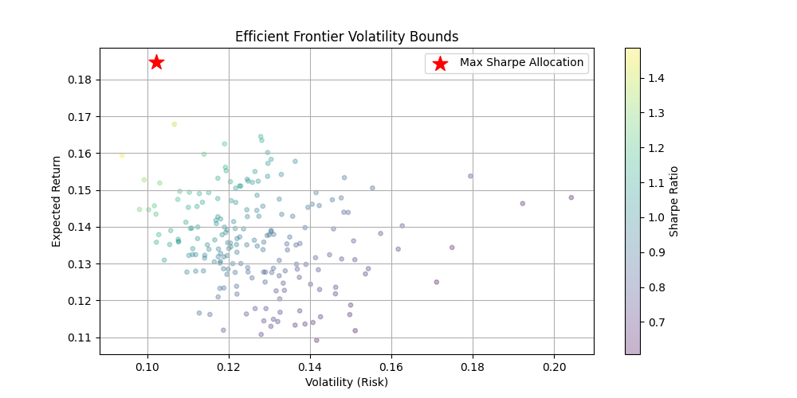

# Portfolio Optimization


A focused Python implementation of **Markowitz mean-variance portfolio optimization** — it computes
risk-adjusted optimal asset weights (Sharpe maximization) and plots the **efficient frontier** using
SciPy's constrained optimizer.

> A compact, single-script implementation (`optimization.py`) — not a web app. It's the math core
> you'd drop behind a dashboard like [Veltrix](https://github.com/VenkataVinesh/Veltrix).



## Run
```bash
pip install -r requirements.txt
python optimization.py   # generates synthetic returns, solves weights, saves efficient_frontier.png
```

## Math
- Portfolio return $\mu_p = w^\top\mu$, volatility $\sigma_p = \sqrt{w^\top\Sigma w}$.
- Objective: $\min_w\ -\dfrac{w^\top\mu - R_f}{\sqrt{w^\top\Sigma w}}$
  s.t. $\sum_i w_i = 1,\ w_i \ge 0$ (long-only).

## Why
To implement the Markowitz formulation end-to-end with a real numerical solver (SciPy `minimize`,
SLSQP) rather than a closed-form shortcut — and to see the efficient frontier emerge from the
covariance structure of the returns.
